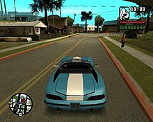
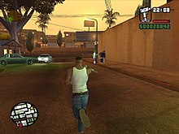

# Grand Theft Auto: San Andreas

**Grand Theft Auto: San Andreas** is a 2004 [action-adventure game](https://en.wikipedia.org/wiki/Action-adventure_game) developed by [Rockstar North](https://en.wikipedia.org/wiki/Rockstar_North) and published by [Rockstar Games](https://en.wikipedia.org/wiki/Rockstar_Games). It is the fifth main entry in the [*Grand Theft Auto* series](https://en.wikipedia.org/wiki/Grand_Theft_Auto), following 2002's [*Grand Theft Auto: Vice City*](https://en.wikipedia.org/wiki/Grand_Theft_Auto:_Vice_City), and the seventh installment overall. It was released in October 2004 for the [PlayStation 2](https://en.wikipedia.org/wiki/PlayStation_2), in June 2005 for [Microsoft Windows](https://en.wikipedia.org/wiki/Microsoft_Windows) and [Xbox](https://en.wikipedia.org/wiki/Xbox_(console)), and in November 2010 for [Mac OS X](https://en.wikipedia.org/wiki/Mac_OS_X). The game is set within an [open world](https://en.wikipedia.org/wiki/Open_world) environment that players can explore and interact with at their leisure. The story follows former gangster [Carl "CJ" Johnson](https://en.wikipedia.org/wiki/Carl_Johnson_(Grand_Theft_Auto)), who returns home following his mother's murder and is drawn back into his former gang and a life of crime while clashing with corrupt authorities and powerful criminals. Carl's journey takes him across the fictional U.S. state of San Andreas, which is heavily based on [California](https://en.wikipedia.org/wiki/California) and [Nevada](https://en.wikipedia.org/wiki/Nevada) and encompasses three major cities: Los Santos (inspired by [Los Angeles](https://en.wikipedia.org/wiki/Los_Angeles)), San Fierro ([San Francisco](https://en.wikipedia.org/wiki/San_Francisco)) and Las Venturas ([Las Vegas](https://en.wikipedia.org/wiki/Las_Vegas)).

The game features references to many real-life elements of the world, such as its cities, regions, and landmarks, with its plot heavily based on several real-life events in Los Angeles in the early 1990s, including the rivalry between real-life [street gangs](https://en.wikipedia.org/wiki/Street_gang), the [crack epidemic](https://en.wikipedia.org/wiki/Crack_epidemic) of the 1980s and early 1990s, the [LAPD Rampart scandal](https://en.wikipedia.org/wiki/Rampart_scandal), and the [1992 Los Angeles riots](https://en.wikipedia.org/wiki/1992_Los_Angeles_riots). Unlike its predecessor, *San Andreas* introduced gameplay elements that were incorporated in later games, including [RPG](https://en.wikipedia.org/wiki/Role-playing_video_game)-style mechanics, customisation options with both clothing and vehicle appearances, a vast array of activities and mini-games, and the inclusion of [gambling](https://en.wikipedia.org/wiki/Gambling) games.

Considered by many reviewers to be one of the [greatest video games ever made](https://en.wikipedia.org/wiki/List_of_video_games_considered_the_best), *San Andreas* received critical acclaim upon release, with praise directed at its music, story and gameplay, and criticism for its graphics and some aspects of its controls. It was the best-selling video game of 2004, and with over 27.5 million copies sold worldwide as of 2011, it is the [best-selling PlayStation 2 game](https://en.wikipedia.org/wiki/List_of_best-selling_PlayStation_2_video_games) and one of the [best-selling video games of all time](https://en.wikipedia.org/wiki/Best-selling_video_games_of_all_time). Like its predecessors, *San Andreas* is cited as a landmark in video games for its far-reaching influence within the industry. The game's violence and sexual content was the source of much public concern and controversy. In particular, a player-made software patch, dubbed the "[Hot Coffee mod](https://en.wikipedia.org/wiki/Hot_Coffee_mod)", unlocked a previously hidden sexual scene, resulting in the game being re-rated AO by the North American [Entertainment Software Rating Board](https://en.wikipedia.org/wiki/Entertainment_Software_Rating_Board) (although its previous M rating was reinstated after the game was edited to remove the content). A [remastered](https://en.wikipedia.org/wiki/Video_game_remaster) version of the game was released for [Android](https://en.wikipedia.org/wiki/Android_(system)) and [iOS](https://en.wikipedia.org/wiki/IOS) in 2013, for [Windows Phone](https://en.wikipedia.org/wiki/Windows_Phone), [Fire OS](https://en.wikipedia.org/wiki/Fire_OS) and [Xbox 360](https://en.wikipedia.org/wiki/Xbox_360) in 2014, and for [PlayStation 3](https://en.wikipedia.org/wiki/PlayStation_3) in 2015. In June 2018, the game was made available for the [Xbox One](https://en.wikipedia.org/wiki/Xbox_One) via [backward compatibility](https://en.wikipedia.org/wiki/List_of_backward-compatible_games_for_Xbox_One_and_Series_X). An enhanced version with the subtitle [*The Definitive Edition*](https://en.wikipedia.org/wiki/Grand_Theft_Auto:_The_Trilogy_%E2%80%93_The_Definitive_Edition) was released in 2021, and a [virtual reality](https://en.wikipedia.org/wiki/Virtual_reality) version for [Oculus Quest 2](https://en.wikipedia.org/wiki/Oculus_Quest_2) is in development. The next main entry in the series, [*Grand Theft Auto IV*](https://en.wikipedia.org/wiki/Grand_Theft_Auto_IV), was released in April 2008.

| Grand Theft Auto: San Andreas                                            |                                                                                                                                                                                                                                                                                                                                                                                                                                                                                                                                                                                                                                                     |
|--------------------------------------------------------------------------|-----------------------------------------------------------------------------------------------------------------------------------------------------------------------------------------------------------------------------------------------------------------------------------------------------------------------------------------------------------------------------------------------------------------------------------------------------------------------------------------------------------------------------------------------------------------------------------------------------------------------------------------------------|
|                          |                                                                                                                                                                                                                                                                                                                                                                                                                                                                                                                                                                                                                                                     |
| [**Developer(s)**](https://en.wikipedia.org/wiki/Video_game_developer)   | [Rockstar North](https://en.wikipedia.org/wiki/Rockstar_North)                                                                                                                                                                                                                                                                                                                                                                                                                                                                                                                                                                                      |
| [**Publisher(s)**](https://en.wikipedia.org/wiki/Video_game_publisher)   | [Rockstar Games](https://en.wikipedia.org/wiki/Rockstar_Games)                                                                                                                                                                                                                                                                                                                                                                                                                                                                                                                                                                                      |
| [**Producer(s)**](https://en.wikipedia.org/wiki/Video_game_producer)     | [Leslie Benzies](https://en.wikipedia.org/wiki/Leslie_Benzies)                                                                                                                                                                                                                                                                                                                                                                                                                                                                                                                                                                                      |
| [**Programmer(s)**](https://en.wikipedia.org/wiki/Video_game_programmer) | Adam Fowler Obbe Vermeij                                                                                                                                                                                                                                                                                                                                                                                                                                                                                                                                                                                                                            |
| [**Artist(s)**](https://en.wikipedia.org/wiki/Video_game_artist)         | Aaron Garbut                                                                                                                                                                                                                                                                                                                                                                                                                                                                                                                                                                                                                                        |
| [**Writer(s)**](https://en.wikipedia.org/wiki/Video_game_writer)         | [Dan Houser](https://en.wikipedia.org/wiki/Dan_Houser) James Worrall [DJ Pooh](https://en.wikipedia.org/wiki/DJ_Pooh)                                                                                                                                                                                                                                                                                                                                                                                                                                                                                                                               |
| [**Composer(s)**](https://en.wikipedia.org/wiki/Video_game_composer)     | [Michael Hunter](https://en.wikipedia.org/wiki/Michael_Hunter_(composer))                                                                                                                                                                                                                                                                                                                                                                                                                                                                                                                                                                           |
| Series                                                                   | [*Grand Theft Auto*](https://en.wikipedia.org/wiki/Grand_Theft_Auto)                                                                                                                                                                                                                                                                                                                                                                                                                                                                                                                                                                                |
| [**Engine**](https://en.wikipedia.org/wiki/Game_engine)                  | [Render Ware](https://en.wikipedia.org/wiki/RenderWare)                                                                                                                                                                                                                                                                                                                                                                                                                                                                                                                                                                                             |
| [**Platform(s)**](https://en.wikipedia.org/wiki/Computing_platform)      | [PlayStation 2](https://en.wikipedia.org/wiki/PlayStation_2) [Microsoft Windows](https://en.wikipedia.org/wiki/Microsoft_Windows) [Xbox](https://en.wikipedia.org/wiki/Xbox_(console)) [Mac OS X](https://en.wikipedia.org/wiki/Mac_OS_X) [iOS](https://en.wikipedia.org/wiki/IOS) [Android](https://en.wikipedia.org/wiki/Android_(operating_system)) [Windows Phone](https://en.wikipedia.org/wiki/Windows_Phone) [Fire OS](https://en.wikipedia.org/wiki/Fire_OS) [Xbox 360](https://en.wikipedia.org/wiki/Xbox_360) [PlayStation 3](https://en.wikipedia.org/wiki/PlayStation_3) [Oculus Quest 2](https://en.wikipedia.org/wiki/Oculus_Quest_2) |
| Release                                                                  | show 26 October 2004                                                                                                                                                                                                                                                                                                                                                                                                                                                                                                                                                                                                                                |
| [**Genre(s)**](https://en.wikipedia.org/wiki/Video_game_genre)           | [Action-adventure](https://en.wikipedia.org/wiki/Action-adventure)                                                                                                                                                                                                                                                                                                                                                                                                                                                                                                                                                                                  |
| Mode(s)                                                                  | [Single-player](https://en.wikipedia.org/wiki/Single-player), [multiplayer](https://en.wikipedia.org/wiki/Multiplayer)                                                                                                                                                                                                                                                                                                                                                                                                                                                                                                                              |

## Gameplay

The player driving a Banshee towards the Grove Street [cul-de-sac](https://en.wikipedia.org/wiki/Cul-de-sac) in Los Santos around the afternoon

*Grand Theft Auto: San Andreas* is an [action-adventure game](https://en.wikipedia.org/wiki/Action-adventure_game) with [role-playing](https://en.wikipedia.org/wiki/Role-playing_video_game) and [stealth](https://en.wikipedia.org/wiki/Stealth_game) elements. Structured similarly to the previous two games in the series, the core gameplay consists of elements of [third-person shooter](https://en.wikipedia.org/wiki/Third-person_shooter) and driving games, affording the player a large, [open-world](https://en.wikipedia.org/wiki/Open_world) environment in which to move around. On foot, the player's character is capable of walking, running, sprinting, swimming, climbing, and jumping as well as using weapons and various forms of hand-to-hand combat. The player can operate a variety of vehicles, including automobiles, buses, semis, boats, fixed-wing aircraft, helicopters, trains, tanks, motorcycles, and bicycles. The player may also import vehicles in addition to stealing them.

The open, non-linear environment allows the player to explore and choose how they wish to play the game. Although storyline missions are necessary to progress through the game and unlock certain cities and content, the player can complete them at their leisure. When not taking on a storyline mission, the player can freely roam the cities and rural areas of San Andreas, eat in restaurants, or cause havoc by attacking people and causing destruction. Creating havoc can attract unwanted and potentially fatal attention from the authorities. The more chaos caused, the stronger the response: police will handle "minor" infractions (attacking pedestrians, pointing [guns](https://en.wikipedia.org/wiki/Gun) at people, stealing vehicles, manslaughter, etc.), whereas [SWAT](https://en.wikipedia.org/wiki/SWAT) teams, the [FBI](https://en.wikipedia.org/wiki/Federal_Bureau_of_Investigation), and the [military](https://en.wikipedia.org/wiki/United_States_Army) respond to higher wanted levels.

The player can partake in a variety of optional side missions that can boost their character's attributes or provide other sources of income. The traditional side missions of past *Grand Theft Auto* games are included, such as dropping off taxi cab passengers, putting out fires, driving injured people to the hospital, and fighting crime as a [vigilante](https://en.wikipedia.org/wiki/Vigilante). New additions include [burglary](https://en.wikipedia.org/wiki/Burglary) missions, [pimping](https://en.wikipedia.org/wiki/Pimping) missions, truck and train driving missions requiring the player to make deliveries on time, and driving/flying/boating/biking schools, which help the player learn skills and techniques to use in their corresponding vehicles.

Not all locations are open to the player at the start of the game. Some locales, such as mod garages, restaurants, gyms, and shops, become available only after completing specific missions. Likewise, for the first portion of the game, only Los Santos and its immediate suburbs are available for exploration; unlocking the other cities and rural areas again requires the completion of specific missions. If the player travels to locked locations early in the game, they will attract the attention of SWAT teams, police, and police-controlled Hydras if in an aircraft.

Unlike [*Grand Theft Auto III*](https://en.wikipedia.org/wiki/Grand_Theft_Auto_III) and [*Vice City*](https://en.wikipedia.org/wiki/Grand_Theft_Auto:_Vice_City), which needed loading screens when the player moved between different districts of the city, *San Andreas* has no load times when the player is in transit. The only loading screens in the game are for cut-scenes and interiors. Other differences between *San Andreas* and its predecessors include the switch from single-player to multiplayer Rampage missions (albeit not in the PC and mobile versions), and the replacement of the "hidden packages" with spray paint tags, hidden camera shots, horseshoes, and oysters to discover.

The camera, fighting, and targeting controls were reworked to incorporate concepts from another [Rockstar](https://en.wikipedia.org/wiki/Rockstar_Games) game, [*Manhunt*](https://en.wikipedia.org/wiki/Manhunt_(video_game)), including various stealth elements, as well as improved target crosshairs and a target health indicator which changes from green to red to black as the target's health decreases. The PC version of the game implements [mouse chording](https://en.wikipedia.org/wiki/Mouse_chording): the player has to hold the right mouse button to activate the [crosshairs](https://en.wikipedia.org/wiki/Crosshair) and then click or hold the left mouse button to shoot or use an item, such as a camera.

The player has a gunfight with members of an enemy gang.

For the first time in the series, players can swim and climb walls. The ability to swim and dive underwater has a great effect on the player as well since water is no longer an impassable barrier that kills the player outright (although it is possible to drown). For greater firepower, the player can also dual-wield firearms or perform a drive-by shooting with multiple gang members who can be recruited to follow the player. Due to the size of San Andreas, a waypoint reticule on the HUD map can be set, aiding the player in reaching a destination.

### Role-playing game features in character development

Rockstar emphasised the [personalisation](https://en.wikipedia.org/wiki/Personalisation) of the main protagonist by adding [role-playing video game](https://en.wikipedia.org/wiki/Role-playing_video_game) elements. Clothing, accessories, haircuts, jewellery, and tattoos are available for purchase by the player, and have more of an effect on [non-player characters](https://en.wikipedia.org/wiki/Non-player_character)' reactions than the clothing in *Vice City*. CJ's level of respect among his fellow recruits and street friends varies according to his appearance and actions, as do his relationships with his girlfriends. The player must ensure that CJ eats to stay healthy and exercises adequately. The balance of food and physical activity affects his appearance and physical attributes.

*San Andreas* tracks acquired skills in areas such as driving, firearms handling, stamina, and lung capacity, which improve through use in the game. CJ may learn three different styles of [hand-to-hand combat](https://en.wikipedia.org/wiki/Hand-to-hand_combat) ([boxing](https://en.wikipedia.org/wiki/Boxing), [kickboxing](https://en.wikipedia.org/wiki/Kickboxing), and [kung fu](https://en.wikipedia.org/wiki/Kung_fu)) at the gyms in each of the game's three cities if he is fit enough. CJ can either positively or negatively respond to most pedestrians' comments in the game. According to Rockstar, there are about 4,200 lines of spoken dialogue for CJ when the cutscenes are excluded.

### Vehicles

In total, there are 212 different vehicles in the game compared to approximately 60 in [*Grand Theft Auto III*](https://en.wikipedia.org/wiki/Grand_Theft_Auto_III). New additions include [bicycles](https://en.wikipedia.org/wiki/Bicycle), a [combine harvester](https://en.wikipedia.org/wiki/Combine_harvester), a [street sweeper](https://en.wikipedia.org/wiki/Street_sweeper), a [jetpack](https://en.wikipedia.org/wiki/Jetpack), and trailers, amongst others. Car [physics](https://en.wikipedia.org/wiki/Game_physics) and features are similar to the [*Midnight Club*](https://en.wikipedia.org/wiki/Midnight_Club) series of [street racing](https://en.wikipedia.org/wiki/Street_racing) games, allowing for much more mid-air vehicle control as well as [nitrous](https://en.wikipedia.org/wiki/Nitrous) upgrades and aesthetic modifications.

There are several different classes of vehicles that serve different purposes. Off-road vehicles perform better in rough environments while racing cars perform better on tracks or the street. [Jets](https://en.wikipedia.org/wiki/Jet_aircraft) are fast, but usually need a [runway](https://en.wikipedia.org/wiki/Runway) to land. [Helicopters](https://en.wikipedia.org/wiki/Helicopter) can land almost anywhere and are much easier to control in the air, but are slower. While previous *Grand Theft Auto* games had only a few aircraft that were difficult to access and fly, *San Andreas* has eleven different types of fixed-wing aircraft and nine helicopters and makes them more integral in the game's missions. There is also the ability to [skydive](https://en.wikipedia.org/wiki/Skydive) from aircraft or from the tops of certain skyscrapers using a parachute. Several types of boats were also added to the game, while some were highly modified.

### Other additions and changes

Other new features and changes from previous Grand Theft Auto games include:

-   **Gang wars**: Battles with enemy gangs are prompted whenever the player ventures into enemy territory and kills at least three gang members. If the player then survives three waves of enemies, the territory will be won, and fellow gang members will begin wandering the streets of these areas. The more territory owned by the player, the more money that will be generated. Occasionally, the player's territory will come under attack from enemy gangs and defeating them will be necessary to retain these areas. Once all marked territories are claimed for the protagonist's gang from one of the two hostile gangs, the opposing gang can no longer attack. Once the player takes control of all territories from both rival gangs, none can come under attack.
-   **Car modification**: Most automobiles in the game can be modified and upgraded at various garages. All car mods are strictly visual apart from the stereo system and [nitrous oxide](https://en.wikipedia.org/wiki/Nitrous_oxide) upgrade, which increases bass and gives the car a speed boost when activated, respectively; and hydraulics, which lowers the car's height by default and allows the player to control various aspects of the car's suspension. Other common modifications include paint jobs, rims, [body kits](https://en.wikipedia.org/wiki/Body_kits), side skirts, bumpers, and spoilers.
-   **Burglary**: [Home invasion](https://en.wikipedia.org/wiki/Home_invasion) is included as a potential money-making activity. By stealing a burglary van, CJ can sneak into a residence at night and cart off valuables or shake down the occupants.
-   **Minigames**: Numerous [minigames](https://en.wikipedia.org/wiki/Minigame) are available for play in *San Andreas*, including [basketball](https://en.wikipedia.org/wiki/Basketball), [pool](https://en.wikipedia.org/wiki/Pool_(game)), [rhythm-based](https://en.wikipedia.org/wiki/Rhythm_game) challenges (dancing and "bouncing" [lowriders](https://en.wikipedia.org/wiki/Lowrider) with hydraulics), [poker](https://en.wikipedia.org/wiki/Poker), and video game machines that pay homage to classic [arcade games](https://en.wikipedia.org/wiki/Arcade_game). Also, there are the aforementioned casino games and methods of gambling, such as betting on virtual [horse races](https://en.wikipedia.org/wiki/Horse_racing).
-   **Money**: The money system has been expanded upon, compared to previous games. Players can spend their cash on gambling, clothes, tattoos, meals, etc. Excessive gambling loss can force the player to sink into debt, which is shown in negative red numbers. When the player leaves a safehouse, CJ gets an unexpected call, and a mysterious person tells him about his debts. Four gang members suddenly appear and shoot Carl on sight if he does not erase the debt when the mysterious person calls him a second time.
-   **Multiplayer**: Rampages have been modified to allow two players to complete them. The players are both shown simultaneously on the screen, meaning they must stay within proximity of each other. The multiplayer rampages provide such functionality.
